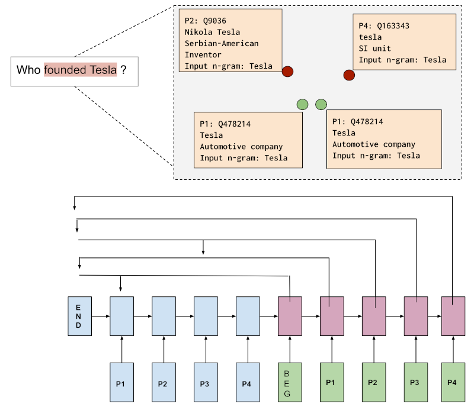

# PNEL: Pointer Network based End-to-End Entity Linking over Knowledge Graphs





**Paper**: https://arxiv.org/abs/2009.00106

## Usage

### Code

```
$ git clone git@github.com:debayan/pnel.git
$ cd pnel
$ virtualenv -p python3 .
$ source bin/activate
(pnel)$ pip3 install -r requirements.txt
```

### Elasticsearch
The first step towards using our model is to populate an Elasticsearch instance with the following 3 indices:

1. Entity Embeddings
2. Entity Descriptions
3. Entity Labels

First Install an Elasticsearch 7.x instance.

Then install elasticdump version 6.33.4 ( ```npm install elasticdump@6.33.4``` ). 

Then create indices and mappings as specified in ```pnel/deploy/data/esdumps/mappings.json```.

Now load data. Download the following 2 dumps of indices:

https://ltdata1.informatik.uni-hamburg.de/debayanpnel/wikidataentitydescriptionsindex01.tgz

https://ltdata1.informatik.uni-hamburg.de/debayanpnel/wikidataentitylabelindex01.tgz

Unzip them using `tar -zxvf` program, and import them into the ES instance. Adjust the ```--limit``` field based on available memory in your ES instance.
```
(pnel)$ elasticdump --limit=10000 --input=wikidataentitydescriptionsindex01.json --output=http://localhost:9200/wikidataentitydescriptionsindex01 --type=data
(pnel)$ elasticdump --limit=10000 --input=wikidataentitylabelindex01.json --output=http://localhost:9200/wikidataentitylabelindex01 --type=data
```
To import the third index, i.e., the TransE embeddings for Wikidata, download the pre-trained embeddings provided by PyTorch BigGraph.

```
(pnel)$ cd pnel/deploy/data
(pnel)$ wget https://dl.fbaipublicfiles.com/torchbiggraph/wikidata_translation_v1.tsv.gz
(pnel)$ gunzip wikidata_translation_v1.tsv.gz (this takes a long time)
(pnel)$ cd ../utils
(pnel)$ python loadwikiembeds.py (may take more than 12 hours)
```
Loading of all indices into ES is now done.
  
### Vectorisation

For training on a dataset it must be vectorised first.
```
(pnel)$ cd ../../pnel/vectorise
(pnel)$ python preparedatangramtextmatchdesc.py datasets/unifiedtrain.json webqtrain webqtrainvectors.txt
```
The command above generates vectors for the train set of WebQSP. The vectors are written to ```webqtrainvectors.txt``` where each line is the vector form of one question in the dataset. 

For LC-QuAD 2.0 and SimpleQuestions, replace ```webqtrain``` with ```lcq2train``` and ```simplequestiontrain``` respectively. Change the output filename according to your preferred naming convention.

For generating vectors for the test sets, e.g., for WebQSP (which we shall require later) :
```
(pnel)$ python preparedatangramtextmatchdesc.py datasets/unifiedtest.json webqtest webqtestvectors.txt
```
For LC-QuAD 2.0 and SimpleQuestions, replace ```webqtest```  with ```lcq2test``` and ```simplequestiontest``` respectively.

### Training
We use the generated vectors above to train a model. The vector files can be very large ( hundreds of GBs ) and they should be split into smaller files, where the number of lines in each file is equal to the batch size during training. The batch size during training needs to be decided based on the GPU memory available. Assuming we proceed with a batch size of 10, we split the vector file into smaller parts:
```
(pnel)$ mkdir webqtrainchunks
(pnel)$ cd webqtrainchunks/
(pnel)$ split -l 10 ../webqtrainvectors.txt webqchunk
```
The above command generates several files, each file 10 lines in size (each line has hundreds of vectors). The chunks are located in the ```webqtrainchunks/``` folder. Generate similar data for the test set as well. Now move to the training script directory.

```
(pnel)$ cd ../../pnel/train/
(pnel)$ ln -s ../vectorise/webqtrainchunks/ . 
(pnel)$ ln -s ../vectorise/webqtestvectors.txt .
(pnel)$ mkdir -p models/webqmodels
(pnel)$ CUDA_VISIBLE_DEVICES=0 python -u train.py --data_path ./webqtrainchunks/ --test_data_path ./webqtestchunks.txt --models_dir ./models/webqmodels/
```
You may change several parameters at the beginning of ```train.py``` script, also via the command line. As the training proceeds, a small part of the test set is used as validation set. The models are stored in ```./models/webqmodels/``` folder.


### Deployment
It is possible to use the generated model to deploy a REST API for Entity Linking. 
```
(pnel)$ cd ../deploy
(pnel)$ ln -s ../train/models/ .
(pnel)$ cd data/ && wget https://ltdata1.informatik.uni-hamburg.de/debayanpnel/fasttext-wiki-news-subwords-300 && cd ../
(pnel)$ python TextMatchServer.py 8887
(pnel)$ python api.py --port 4444 --modeldir ./train/models/webqmodels/ --layers 1 --rnnsize 512 --attentionsize 128
```
For ```layers```,```rnnsize``` and ```attentionsize```, use the same values used during training the model.

The above command starts an API at port 4444. To access it one may use the following curl command:
```
$ curl -XPOST 'localhost:4444/processQuery' -H 'Content-Type: application/json' -d"{\"nlquery\":\"Where was Narendra Modi born ?\"}"
```


### Evaluation

For LC-QuAD 2.0
```
(pnel)$ cd pnel/eval/lcquad2/
(pnel)$ python parse.py (this hits the API with test set questions)
(pnel)$ python judge.py (this produces the F1 score)
```
For other datasets, use the other folders in ```pnel/eval/```.

### Pre-trained models

For LC-QuAD 2.0, download https://ltdata1.informatik.uni-hamburg.de/debayanpnel/lcq1142.tgz, uncompress it using ```tar -zxvf```, then
```
(pnel)$ python api.py --port 4444 --modeldir ./lcq1142/ --rnnsize 512 --attentionsize 128 --layers 1
```

For WebQSP, download https://ltdata1.informatik.uni-hamburg.de/debayanpnel/webq1142.tgz, uncompress it using ```tar -zxvf```, then
```
(pnel)$ python api.py --port 4444 --modeldir ./lcq1142/ --rnnsize 256 --attentionsize 64 --layers 1
```
###Live API

```
(pnel)$ curl -XPOST 'ltdemos.informatik.uni-hamburg.de/pnel/processQuery' -H 'Content-Type: application/json' -d"{\"nlquery\":\"is hamburg in germany or is it in austria ?\"}"
```


## Citation


    @InProceedings{10.1007/978-3-030-62419-4_2,
	    author="Banerjee, Debayan
	    and Chaudhuri, Debanjan
	    and Dubey, Mohnish
	    and Lehmann, Jens",
	    title="PNEL: Pointer Network Based End-To-End Entity Linking over Knowledge Graphs",
	    booktitle="The Semantic Web -- ISWC 2020",
	    year="2020",
	    publisher="Springer International Publishing",
	    pages="21--38"
    }


